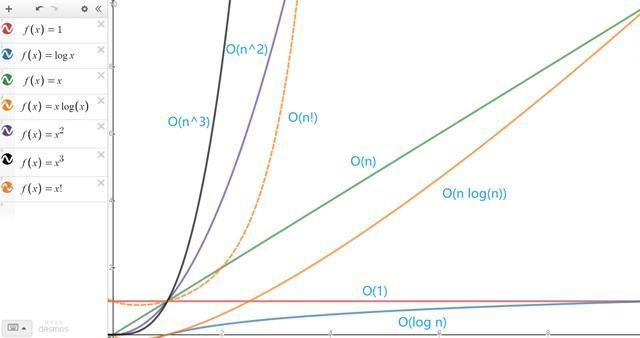

# 介绍 *

复杂度是评估算法、数据结构性能好坏的指标，就如长度单位有cm、m，容量单位有mm。

复杂度通常从时间、空间进行评估，称为时间复杂度、空间复杂度。

> 时间复杂度： 一个算法所耗费的时间，由于每个电脑的性能有所不同，无法计算出具体值。
>
> 空间复杂度： 算法执行过程中所需要的空间，通常可由数据类型算出具体值（内存占用）。

复杂度可在三种情况的评估出：最优情况、平均情况、最差情况。

系统设计中常常会假设最差情况进行兜底，最后在此基础上进行优化，所以通常评估复杂度采用的是最差情况，表示为O，读作Big O表示法。

在评估过程中，会忽略常数项，并取最高阶作为结果。

例如：

1. `5*N^2+5*N`，先忽略常数项变为`N^2+N`，再取最高阶的项作为结果，即`N^2`。
2. `6*N^3+5*N^2+5*N`，先忽略常数项变为`N^3+N^2+N`，再取最高阶的项作为结果，即`N^3`。

> 一个算法的最坏情况运行时间是在任何输入下运行时间的一个上界（Upper Bound）。
>
> 对于某些算法，最坏情况出现的较为频繁。
>
> 大体上看，平均情况通常与最坏情况一样差。

常见的最差复杂度指标：
- O(1)：算法执行时间或耗费的空间与输入数据无关。
- O(logN)：算法执行时间或耗费的空间与输入数据比例为logN(对数级增长)。
- O(N)：算法执行时间或耗费的空间与输入数据成正比(线性增长)。
- O(N^M)：算法执行时间或耗费的空间与输入数据比例为M次方(指数级增长)。

> logN是以2为底的简写。

通过图例可清晰的看出不同复杂度的增长趋势。

接下来我们通过几个经典案例，实践复杂度评估。